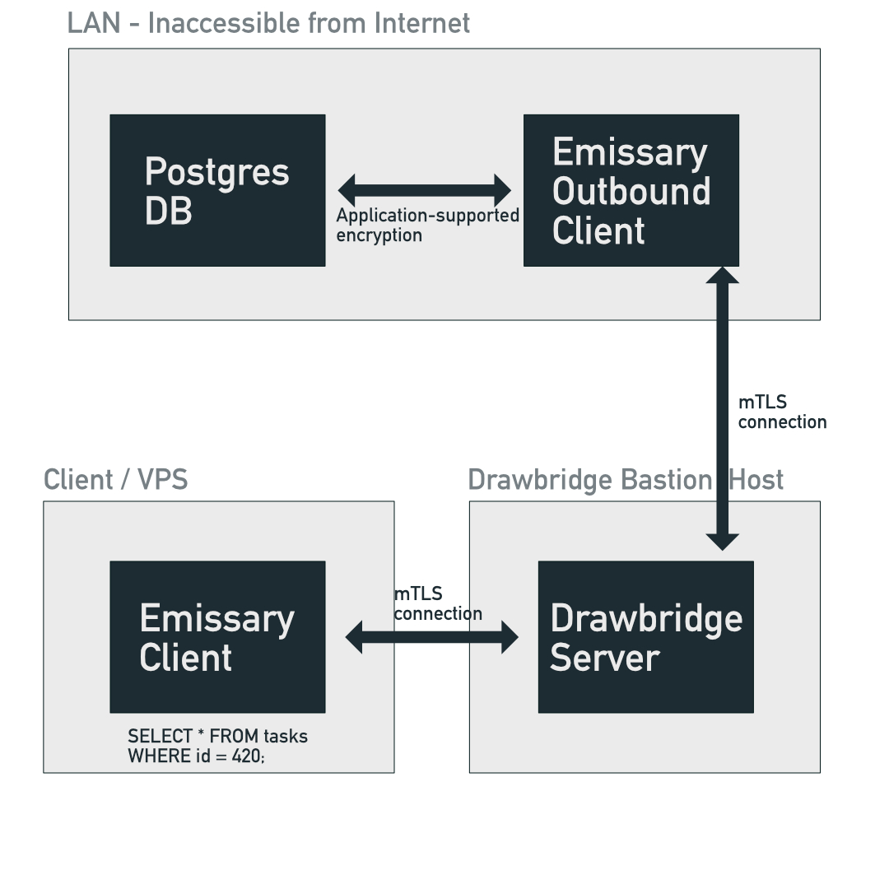

# Emissary Outbound

Emissary, needs to also support linking a local service accessible via the machine running Emissary, as a Protected Service in Drawbridge e.g an outbound tunnel.

We can have an alternate Emissary client mode, called Outbound, that simply points to a server accessible from the Emissary client. Proxying in the same way Drawbridge does to a Protected Service.

## Example

Let's say there is a Postgres db on a LAN network, inaccessible from the public internet, and an EC2 aws instance on the same LAN, which can access the db.

To access the db remotely, without modifying any firewall settings, we can use Emissary Outbound to point to the Postgres db, and Emissary Outbound will make an Outbound connection to Drawbridge, and expose the db as a Protected Service. Then, any normal Emissary client can connect to the DB via Drawbridge.

This allows us to have complete freedom and a secure way to expose Protected Services via an end-to-end encrypted connection.
